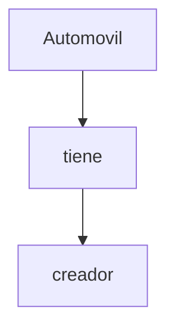
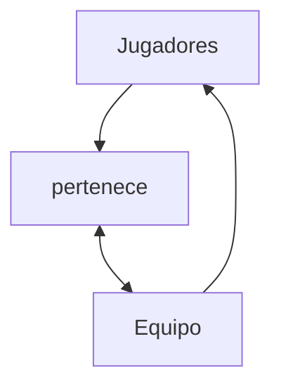
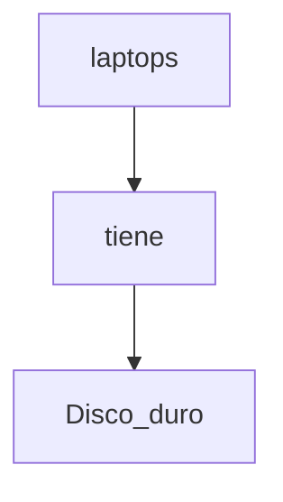

<h1>Fundamentos de Base de Datos</h1>

<h3>Israel Vázquez Morales</h3>

<h1>Tabla de Contenido</h1>

- [1. Bienvenida conceptos básicos y contexto histórico de las Bases de Datos](#1-bienvenida-conceptos-básicos-y-contexto-histórico-de-las-bases-de-datos)
  - [Bienvenida conceptos básicos y contexto histórico de las Bases de Datos](#bienvenida-conceptos-básicos-y-contexto-histórico-de-las-bases-de-datos)
- [2. Introducción a las bases de datos relacionales](#2-introducción-a-las-bases-de-datos-relacionales)
  - [Historia de las RDB](#historia-de-las-rdb)
  - [Entidades y atributos](#entidades-y-atributos)
  - [Entidades de Platzi Blog](#entidades-de-platzi-blog)
  - [Relaciones](#relaciones)
  - [Múltiples muchos](#múltiples-muchos)
  - [Diagrama ER](#diagrama-er)
  - [Diagrama Físico: tipos de datos y constraints](#diagrama-físico-tipos-de-datos-y-constraints)
      - [Tipos de dato:](#tipos-de-dato)
      - [Constraints (Restricciones)](#constraints-restricciones)
  - [Diagrama Físico: normalización](#diagrama-físico-normalización)
  - [Diagrama Físico: normalizando Platziblog](#diagrama-físico-normalizando-platziblog)
  - [Formas normales en DB relacionales](#formas-normales-en-db-relacionales)
- [3. RDBMS (MySQL) o cómo hacer lo anterior de manera práctica](#3-rdbms-mysql-o-cómo-hacer-lo-anterior-de-manera-práctica)
  - [RDB ¿Qué?](#rdb-qué)
  - [Instalación local de un RDBMS (Windows)](#instalación-local-de-un-rdbms-windows)
  - [Instalación local de un RDBMS (Mac)](#instalación-local-de-un-rdbms-mac)
  - [Instalación local de un RDBMS (Ubuntu)](#instalación-local-de-un-rdbms-ubuntu)
    - [Para configurar workbench:](#para-configurar-workbench)
    - [Workbench Linux](#workbench-linux)
    - [Error al installar Workbench](#error-al-installar-workbench)
  - [Clientes gráficos](#clientes-gráficos)
    - [Verificar la configuracion de MySQL](#verificar-la-configuracion-de-mysql)
  - [Servicios administrados](#servicios-administrados)
- [4. SQL hasta en la sopa](#4-sql-hasta-en-la-sopa)
  - [Historia de SQL](#historia-de-sql)
  - [DDL create](#ddl-create)
  - [CREATE VIEW y DDL ALTER](#create-view-y-ddl-alter)
  - [DDL drop](#ddl-drop)
  - [DML](#dml)
      - [DDL -> Data Definition Language](#ddl---data-definition-language)
      - [DML -> Data Manipulation Language](#dml---data-manipulation-language)
  - [¿Qué tan standard es SQL?](#qué-tan-standard-es-sql)
  - [Creando Platziblog: tablas independientes](#creando-platziblog-tablas-independientes)
  - [Creando Platziblog: tablas dependientes](#creando-platziblog-tablas-dependientes)
  - [Creando Platziblog: tablas transitivas](#creando-platziblog-tablas-transitivas)
- [5. Consultas a una base de datos](#5-consultas-a-una-base-de-datos)
  - [¿Por qué las consultas son tan importantes?](#por-qué-las-consultas-son-tan-importantes)
  - [Estructura básica de un Query](#estructura-básica-de-un-query)
    - [Atajos con el teclado ue nos pueden ayudar a la escritura y ejecución del código SQL](#atajos-con-el-teclado-ue-nos-pueden-ayudar-a-la-escritura-y-ejecución-del-código-sql)
  - [SELECT](#select)
  - [FROM](#from)
  - [Utilizando la sentencia FROM](#utilizando-la-sentencia-from)
  - [WHERE](#where)
  - [Utilizando la sentencia WHERE nulo y no nulo](#utilizando-la-sentencia-where-nulo-y-no-nulo)
  - [GROUP BY](#group-by)
  - [ORDER BY y HAVING](#order-by-y-having)
  - [El interminable agujero de conejo (Nested queries)](#el-interminable-agujero-de-conejo-nested-queries)
  - [¿Cómo convertir una pregunta en un query SQL?](#cómo-convertir-una-pregunta-en-un-query-sql)
  - [Preguntándole a la base de datos](#preguntándole-a-la-base-de-datos)
  - [Consultando PlatziBlog](#consultando-platziblog)
- [6. Introducción a la bases de datos NO relacionales](#6-introducción-a-la-bases-de-datos-no-relacionales)
  - [¿Qué son y cuáles son los tipos de bases de datos no relacionales?](#qué-son-y-cuáles-son-los-tipos-de-bases-de-datos-no-relacionales)
  - [Tipos de bases de datos no relacionales:](#tipos-de-bases-de-datos-no-relacionales)
  - [Servicios administrados y jerarquía de datos](#servicios-administrados-y-jerarquía-de-datos)
  - [Jerarquía de datos:](#jerarquía-de-datos)
  - [Estructura de una base de datos No relacional basada en documentos](#estructura-de-una-base-de-datos-no-relacional-basada-en-documentos)
- [7. Manejo de modelos de datos en bases de datos no relacionales](#7-manejo-de-modelos-de-datos-en-bases-de-datos-no-relacionales)
  - [Top level collection con Firebase](#top-level-collection-con-firebase)
  - [Creando y borrando documentos en Firestore](#creando-y-borrando-documentos-en-firestore)
  - [Tipos de datos en Firestore:](#tipos-de-datos-en-firestore)
  - [Colecciones vs subcolecciones](#colecciones-vs-subcolecciones)
  - [Recreando Platziblog](#recreando-platziblog)
  - [Construyendo Platziblog en Firestore](#construyendo-platziblog-en-firestore)
  - [Proyecto final: transformando tu proyecto en una db no relacional](#proyecto-final-transformando-tu-proyecto-en-una-db-no-relacional)
  - [¿Cómo saber cuál escoger?](#cómo-saber-cuál-escoger)
  - [Regla 1. Piensa en la vista de tu aplicación](#regla-1-piensa-en-la-vista-de-tu-aplicación)
  - [Regla 2. La colección tiene vida propia](#regla-2-la-colección-tiene-vida-propia)
  - [Regla 3. Piensa a futuro](#regla-3-piensa-a-futuro)
- [8. Bases de datos en la vida real](#8-bases-de-datos-en-la-vida-real)
  - [Bases de datos en la vida real](#bases-de-datos-en-la-vida-real)
  - [Big Data](#big-data)
  - [Data warehouse](#data-warehouse)
  - [Data mining](#data-mining)
  - [ETL](#etl)
  - [Business intelligence](#business-intelligence)
  - [Machine Learning](#machine-learning)
  - [Data Science](#data-science)
  - [¿Por qué aprender bases de datos hoy?](#por-qué-aprender-bases-de-datos-hoy)
- [9. Bonus](#9-bonus)
  - [Bases de datos relacionales vs no relacionales](#bases-de-datos-relacionales-vs-no-relacionales)
  - [Elegir una base de datos](#elegir-una-base-de-datos)

---

# 1. Bienvenida conceptos básicos y contexto histórico de las Bases de Datos
  ## Bienvenida conceptos básicos y contexto histórico de las Bases de Datos

Tu profesor será Israel Vázquez, senior web developer en San Francisco, seminarista de bases de datos y entusiasta data engineering.
El almacenamiento en la nube tiene un gran pro comparada con los otros métodos de almacenamiento ya que es accesible desde cualquier parte del mundo. Además es centralizada y puede ser usada por varias personas al mismo tiempo.

Las bases de datos entran cuando hacemos la transición a medios digitales.

**Tipos de bases de datos:**

**Relacionales:** En la industria hay varias compañías dedicadas a ser manejadoras de bases de datos relacionales como SQL Server, Oracle, MariaDB, entre otras.
**No relacionales:** Todavía están avanzando y existen ejemplos muy distintos como cassandra, elasticsearch, neo4j, MongoDB, entre otras.

**Servicios:**

  - **Auto administrados:** Es la base de datos que instalas tú y te encargas de actualizaciones, mantenimiento, etc.
  - **Administrados:** Servicios que ofrecen las nubes modernas como Azure y no debes preocuparte por mantenimiento o actualizaciones.

  - [Fundamentos de Base de Datos.pdf](https://drive.google.com/file/d/1V982h0oTtJUuSubzd88d4-rFBqVOOopX/view?usp=sharing)
  - [Bases de Datos Relacionalesvs No relacionales](https://aukera.es/blog/bases-de-datos-relacionales-vs-no-relacionales/)

# 2. Introducción a las bases de datos relacionales

  ## Historia de las RDB

Las bases de datos surgen de la necesidad de conservar la información más allá de lo que existe en la memoria RAM.

Las bases de datos basadas en archivos eran datos guardados en texto plano, 
fáciles de guardar pero muy difíciles de consultar y por la necesidad de mejorar esto nacen las bases de datos relacionales. 
Su inventor Edgar Codd dejó ciertas reglas para asegurarse de que toda la filosofía de las bases de datos no se perdiera, estandarizando el proceso.

- [Codd's 12 rules](https://www.w3resource.com/sql/sql-basic/codd-12-rule-relation.php)
- [Las 12 reglas de CODD del Modelo Relacional](https://www.mindmeister.com/es/1079684487/las-12-reglas-de-codd-del-modelo-relacional?fullscreen=1#)

**Bases de datos relacionales (RBD)**

Es importante que sea fácil de guardar y extraer, anteriormente se usaban bases de datos basadas en archivos, el cuál era texto plano fácil de guardar, pero difícil de extraer, por esto se inventaron las bases de datos relacionales. En 1990 Codd se preocupó porque los sistemas de gestión de bases de datos (SGBD) que decían ser relacionales, no lo eran. En la práctica es difícil cumplir las 12 pero, un SGBD es más relacional cuantas más reglas cumpla

Las Reglas y mandamientos de Edgar Frank Ted Codd

- Regla 0: Regla de fundación.
a) Cualquier sistema que se proclame como relacional, debe ser capaz de gestionar sus bases de datos enteramente mediante sus capacidades relacionales.

- Regla 1: Regla de la información.
a) Todos los datos deben estar almacenados en las tablas
b) Esas tablas deben cumplir las premisas del modelo relacional
c) No puede haber información a la que accedemos por otra vía

- Regla 2: Regla del acceso garantizado.
a) Cualquier dato es accesible sabiendo la clave de su fila y el nombre de su columna o atributo
b) Si a un dato no podemos acceder de esta forma, no estamos usando un modelo relacional

- Regla 3: Regla del tratamiento sistemático de valores nulos.
a) Esos valores pueden dar significado a la columna que los contiene
b) El SGBD debe tener la capacidad de manejar valores nulos
c) El SGBD reconocerá este valor diferenciándolo de cualquier otro
d) El SGBD deberá aplicársele la lógica apropiada
e) Es un valor independiente del tipo de datos de la columna

- Regla 4: Catálogo dinámico en línea basado en el modelo relacional.
a) El catálogo en línea es el diccionario de datos
b) El diccionario de datos se debe de poder consultar usando las mismas técnicas que para los datos
c) Los metadatos, por tanto, se organizan también en tablas relacionales
d) Si SELECT es una instrucción que consulta datos, también será la que consulta los metadatos

- Regla 5: Regla comprensiva del sublenguaje de los datos completo.
a) Al menos tiene que existir un lenguaje capaz de hacer todas las funciones del SGBD
b) No puede haber funciones fuera de ese lenguaje
c) Puede haber otros lenguajes en el SGBD para hacer ciertas tareas
d) Pero esas tareas también se deben poder hacer con el “lenguaje completo”

- Regla 6: Regla de actualización de vistas.
a) Las vistas tienen que mostrar información actualizada
b) No puede haber diferencias entre los datos de las vistas y los datos de las tablas base

- Regla 7: Alto nivel de inserción, actualización, y cancelación.
a) La idea es que el lenguaje que maneja la base de datos sea muy humano
b) Eso implica que las operaciones del lenguaje de manipulación de los datos (DML) trabajen con conjuntos de filas a la vez
c) Para modificar, eliminar o añadir datos, no hará falta programar de la forma en la que lo hacen los lenguajes de tercera generación como C o Java

- Regla 8: Independencia física de los datos.
a) Cambios en la física de la BD no afecta a las aplicaciones ni a los esquemas lógicos
b) El acceso a las tablas (elemento lógico) no cambia porque la física de la base de datos cambie

- Regla 9: Independencias lógicas de los datos.
a) Cambios en el esquema lógico (tablas) de la BD no afectan al resto de esquemas
b) Si cambiamos nombres de tabla, o de columna o modificamos información de las filas, las aplicaciones (esquema externo) no se ven afectadas
c) Es más difícil de conseguir

- Regla 10: Independencia de la integridad.
a) Las reglas de integridad (restricciones) deben de ser gestionadas y almacenadas por el SGBD

- Regla 11: Independencia de la distribución.
a) Que la base de datos se almacene o gestione de forma distribuida en varios servidores, no afecta al uso de esta ni a la programación de las aplicaciones de usuario
b) El esquema lógico es el mismo independientemente de si la BD es distribuida o no

- Regla 12: La regla de la no subversión.
a) La base de datos no permitirá que exista un lenguaje o forma de acceso, que permita saltarse las reglas anteriores

  ## Entidades y atributos

Una **entidad** es algo similar a un objeto (programación orientada a objetos) y representa algo en el mundo real, incluso algo abstracto. Tienen atributos que son las cosas que los hacen ser una entidad y por convención se ponen en plural.

Los **atributos compuestos** son aquellos que tienen atributos ellos mismos.

Los **atributos llave** son aquellos que identifican a la entidad y no pueden ser repetidos. Existen:

  - Naturales: son inherentes al objeto como el número de serie
  - Clave artificial: no es inherente al objeto y se asigna de manera arbitraria.

**Entidades fuertes:** son entidades que pueden sobrevivir por sí solas.

**Entidades débiles:** no pueden existir sin una entidad fuerte y se representan con un cuadrado con doble línea.

  - Identidades débiles por identidad: no se diferencian entre sí más que por la clave de su identidad fuerte.
  - Identidades débiles por existencia: se les asigna una clave propia.

- [Chen-Notation](https://de.wikipedia.org/wiki/Chen-Notation)

Ejemplo:

Una entidad es algo similar a un objeto (programación orientada a objetos) y representa algo en el mundo real, incluso algo abstracto. Las entidades se escriben en Plural y están representadas por un conjunto de atributos

Estas pueden ser:
  - Concreta: Persona, empleado, casa, auto, etc …
  - Abstracta: cta bancaría, empresa, curso

  

  - Multivaluados: puede tener varios valores (teléfonos, hijos, discos duros)
  - Compuestos: desde los cuales se desprenden más atributos
  - Llave: aquel que identifica la entidad y no se puede repetir y existen dos tipos:
    - Natural: Son inherentes del Objeto (Cedula, No. Serie)
    - Artificial: No es inherente al objeto y se asigna arbitrariamente
  - Derivados: es aquel que se obtiene de un atributo definido (fecha Nac = edad)

  ## Entidades de Platzi Blog

Nuestro proyecto será un manejador de Blogpost. Es un contexto familiar y nos representará retos muy interesantes.

  - Primer paso: Identificar las entidades
  - Segundo paso: Pensar en los atributos

  **Diagrama de Platziblog**
   
  - 


  ## Relaciones

Las relaciones nos permiten ligar o unir nuestras diferentes entidades y se representan con rombos. Por convención se definen a través de verbos.

Las relaciones tienen una propiedad llamada cardinalidad y tiene que ver con números. Cuántos de un lado pertenecen a cuántos del otro lado:

  - Cardinalidad: 1 a 1
  - Cardinalidad: 0 a 1
  - Cardinalidad: 1 a N
  - Cardinalidad: 0 a N


**Diagrama No. 1**



**Diagrama No. 2**



**Relaciones**



**Relaciones**

Las relaciones, representadas por un rombo, sirven para crear relaciones entre entidades. Por convención las relaciones son verbos que conectan entidades. Existen entidades multivaluadas o compuestas que tienen vida propia y se relacionan con otras entidades, por lo que se pueden normalizar (concepto que se explicará luego)

Cardinalidad

Es una propiedad de las relaciones que indica la cantidad y correspondencia con la que puede estar relacionada una entidad y puede ser uno a uno, uno a varios, varios a uno y varios a varios.


  ## Múltiples muchos

Cardinalidades múltiples muchos: También conocida como “Muchos a Muchos”. Es el tipo de cardinalidad en el que muchas entidades de un tipo, pertenecen a muchas entidades de otro, la cual debe ser normalizada y relacionada a partir de llaves foráneas.


  ## Diagrama ER

Un diagrama es como un mapa y nos ayuda a entender cuáles son las entidades con las que vamos a trabajar, cuáles son sus relaciones y qué papel van a jugar en las aplicaciones de la base de datos.


- [Top 5 Free Database Diagram Design Tools](https://www.holistics.io/blog/top-5-free-database-diagram-design-tools/#dbdiagramio)
- [Lucidchart](https://www.lucidchart.com/pages/es/simbolos-de-diagramas-entidad-relacion)
- [Cardinalities](https://en.wikipedia.org/wiki/Entity%E2%80%93relationship_model#Cardinalities)
- [Diagrams](https://app.diagrams.net/)

  ## Diagrama Físico: tipos de datos y constraints

  Para llevar a la práctica un diagrama debemos ir más allá y darle detalle con parámetros como:

  #### Tipos de dato:

  - **Texto:** CHAR(n), VARCHAR(n), TEXT
  - **Números:** INTEGER, BIGINT, SMALLINT, DECIMAL(n,s), NUMERIC(n,s)
  - **Fecha/hora:** DATE, TIME, DATETIME, TIMESTAMP
  - **Lógicos:** BOOLEAN

  #### Constraints (Restricciones)

  - **NOT NULL:** Se asegura que la columna no tenga valores nulos
  - **UNIQUE:** Se asegura que cada valor en la columna no se repita
  - **PRIMARY KEY:** Es una combinación de NOT NULL y UNIQUE
  - **FOREIGN KEY:** Identifica de manera única una tupla en otra tabla
  - **CHECK:** Se asegura que el valor en la columna cumpla una condición dada
  - **DEFAULT:** Coloca un valor por defecto cuando no hay un valor especificado
  - **INDEX:** Se crea por columna para permitir búsquedas más rápidas

  ## Diagrama Físico: normalización

La normalización como su nombre lo indica nos ayuda a dejar todo de una forma normal. Esto obedece a las 12 reglas de Codd y nos permiten separar componentes en la base de datos:

- **Primera forma normal (1FN):** Atributos atómicos (Sin campos repetidos)
- **Segunda forma normal (2FN):** Cumple 1FN y cada campo de la tabla debe depender de una clave única.
- **Tercera forma normal (3FN):** Cumple 1FN y 2FN y los campos que NO son clave, NO deben tener dependencias.
- **Cuarta forma normal (4FN):** Cumple 1FN, 2FN, 3FN y los campos multivaluados se identifican por una clave única.


  ## Diagrama Físico: normalizando Platziblog

La normalización como su nombre lo indica nos ayuda a dejar todo de una forma normal. Esto obedece a las 12 reglas de Codd y nos permiten separar componentes en la base de datos:


  ## Formas normales en DB relacionales

La normalización en las bases de datos relacionales es uno de esos temas que, por un lado es sumamente importante y por el otro suena algo esotérico. Vamos a tratar de entender las formas normales (FN) de una manera simple para que puedas aplicarlas en tus proyectos profesionales.

**Primera Forma Normal (1FN)**

Esta FN nos ayuda a eliminar los valores repetidos y no atómicos dentro de una base de datos.

Formalmente, una tabla está en primera forma normal si:

- Todos los atributos son atómicos. Un atributo es atómico si los elementos del dominio son simples e indivisibles.
- No debe existir variación en el número de columnas.
- Los campos no clave deben identificarse por la clave (dependencia funcional).
- Debe existir una independencia del orden tanto de las filas como de las columnas; es decir, si los datos cambian de orden no deben cambiar sus significados.

Se traduce básicamente a que si tenemos campos compuestos como por ejemplo `“nombre_completo”` que en realidad contiene varios datos distintos, en este caso podría ser `“nombre”, “apellido_paterno”, “apellido_materno”`, etc.

También debemos asegurarnos que las columnas son las mismas para todos los registros, que no haya registros con columnas de más o de menos.

Todos los campos que no se consideran clave deben depender de manera única por el o los campos que si son clave.

Los campos deben ser tales que si reordenamos los registros o reordenamos las columnas, cada dato no pierda el significado.

**Segunda Forma Normal (2FN)**

Esta FN nos ayuda a diferenciar los datos en diversas entidades.

Formalmente, una tabla está en segunda forma normal si:

- Está en 1FN
- Sí los atributos que no forman parte de ninguna clave dependen de forma completa de la clave principal. Es decir, que no existen dependencias parciales.
- Todos los atributos que no son clave principal deben depender únicamente de la clave principal.

Lo anterior quiere decir que sí tenemos datos que pertenecen a diversas entidades, cada entidad debe tener un campo clave separado. Por ejemplo:


En la tabla anterior tenemos por lo menos dos entidades que debemos separar para que cada uno dependa de manera única de su campo llave o ID. En este caso las entidades son alumnos por un lado y materias por el otro. En el ejemplo anterior, quedaría de la siguiente manera:


**Tercera Forma Normal (3FN)**

Esta FN nos ayuda a separar conceptualmente las entidades que no son dependientes.

Formalmente, una tabla está en tercera forma normal si:

Se encuentra en 2FN
No existe ninguna dependencia funcional transitiva en los atributos que no son clave

Esta FN se traduce en que aquellos datos que no pertenecen a la entidad deben tener una independencia de las demás y debe tener un campo clave propio. Continuando con el ejemplo anterior, al aplicar la 3FN separamos la tabla alumnos ya que contiene datos de los cursos en ella quedando de la siguiente manera.


**Cuarta Forma Normal (4FN)**

Esta FN nos trata de atomizar los datos multivaluados de manera que no tengamos datos repetidos entre rows.

Formalmente, una tabla está en cuarta forma normal si:

- Se encuentra en 3FN
- Los campos multivaluados se identifican por una clave única

Esta FN trata de eliminar registros duplicados en una entidad, es decir que cada registro tenga un contenido único y de necesitar repetir la data en los resultados se realiza a través de claves foráneas.

Aplicado al ejemplo anterior la tabla materia se independiza y se relaciona con el alumno a través de una tabla transitiva o pivote, de tal manera que si cambiamos el nombre de la materia solamente hay que cambiarla una vez y se propagara a cualquier referencia que haya de ella.


De esta manera, aunque parezca que la información se multiplicó, en realidad la descompusimos o normalizamos de manera que a un sistema le sea fácil de reconocer y mantener la consistencia de los datos.

Algunos autores precisan una 5FN que hace referencia a que después de realizar esta normalización a través de uniones (JOIN) permita regresar a la data original de la cual partió.


# 3. RDBMS (MySQL) o cómo hacer lo anterior de manera práctica

## RDB ¿Qué?

RDBMS significa **R**elational **D**atabase **M**anagement **S**ystem o sistema manejador de bases de datos relacionales. Es un programa que se encarga de seguir las reglas de Codd y se puede utilizar de manera programática.

La diferencia entre ambos es que las BBDD son un conjunto de datos pertenecientes ( o al menos en teoría) a un mismo tipo de contexto, que guarda los datos de forma persistente para un posterior uso, y el Sistema de gestión de BBDD o sistema manejador, es el que nos permite acceder a ella, es un software, herramienta que sirve de conexión entre las BBDD y el usuario (nos presenta una interfaz para poder gestionarla, manejarla).

RDBMS

- MySQL
- PostgreSQL
- Etc

Todas toman un lenguaje base, pero cada uno lo apropia, imponiéndole diferentes reglas y características.

## Instalación local de un RDBMS (Windows)

Hay dos maneras de acceder a manejadores de bases de datos:

- Instalar en máquina local un administrador de bases relacional.
- Tener ambientes de desarrollo especiales o servicios cloud.

En este curso usaremos `MySQL` porque tiene un impacto histórico siendo muy utilizado y además es software libre y gratuito.
La versión 5.6.43 es compatible con la mayoría de aplicaciones y frameworks.

- La versión 5.6.43 es compatible con la mayoría de aplicaciones y frameworks.

- [MYSQL](https://dev.mysql.com/downloads/windows/installer/5.6.html)

## Instalación local de un RDBMS (Mac)

Si olvidaste tu clave:

1. Abrir Terminal.
2. Apagar MySQL Server:

```bash
sudo /usr/local/mysql/support-files/mysql.server stop
sudo /usr/local/mysql/support-files/mysql.server status
```

1. Iniciar MySQL en Safe Mode:

```shell
sudo /usr/local/mysql/bin/mysqld_safe --skip-grant-tables
```
1. Abrir otra ventana de la Terminal
2. Iniciar MySQL shell:

```bash
/usr/local/mysql/bin/mysql -u root -p
```

1. Borrar contraseña:

```bash
UPDATE mysql.user SET authentication_string=null WHERE User='root';
FLUSH PRIVILEGES;
exit;
```


1. Crear nueva contraseña:

```bash
ALTER USER 'root'@'localhost' IDENTIFIED WITH caching_sha2_password BY 'tunuevacontraseña';
```

1. Salir de MySQL Shell:
```bash
exit;
```

1. Reiniciar el Server:

```bash
sudo /usr/local/mysql/support-files/mysql.server stop
sudo /usr/local/mysql/support-files/mysql.server start
```

- [MySQL Community Downloads](https://dev.mysql.com/downloads/workbench/)
- [MySQL Community Downloads](https://dev.mysql.com/downloads/mysql/5.7.html)

## Instalación local de un RDBMS (Ubuntu)

- [MySQL Community Server 5.7.33 | Downloads](https://dev.mysql.com/downloads/mysql/5.7.html#downloads)

Dirígete a la sección de selección de descargas y selecciona tu distribución de Linux. En nuestro caso Ubuntu y selecciona posteriormente la versión que estás utilizando actualmente, en nuestro caso 18.04 de 64 bits.


Más abajo encontrarás las diferentes opciones de descarga existen diversos paquetes dependiendo tus necesidades. En el caso del ejemplo usaremos la versión deb bundle. Da click en el botón Download seleccionado.


En la siguiente pantalla nos piden que nos registremos o iniciemos sesión, pero ya que solo queremos la descarga daremos click en el link que se encuentre en la parte de abajo.


Espera a que la descarga concluya.
Al terminar abre el archivo `.tar` con el desempaquetador de tu preferencia.


Extrae el contenido en la carpeta de tu preferencia.


Selecciona el archivo de servidor de comunidad y ábrelo con tu manejador de paquetes instalado.


Da click en instalar.

Finalmente puedes ir a la consola o terminal de Ubuntu y escribir el siguiente comando.

```bash
sudo mysql
```


A continuación deberá aparecer una ventana con el prompt de mysql donde ya puedes comenzar a ejecutar los comandos de las lecciones.


**Nota:** recuerda estar seguro que las dependencias para el paquete se cumplen para instalar.

**Nota:** muchas veces las distribuciones ya cuentan con paquetes en su repositorio, en ese caso también puedes ejecutar el comando:

```bash
sudo apt-get install mysql-server
```

### Para configurar workbench:

(Que les recomiendo que hagan esto ahora y copien y peguen los comandos tal cual, ya que en las próximas clases les ahorrará tiempo al tratar con un tipo de error).

```bash
sudo mysql -u root
ALTER USER 'root'@'localhost' IDENTIFIED WITH mysql_native_password BY 'TOD@MySQL123'
```

Para abrir workbench:

```bash
sudo mysql-workbench
```

- Click al local host por default.
- Escribir la contraseña ‘password’
- Listo.

### Workbench Linux

- [Download MySQL Workbench](https://www.mysql.com/products/workbench/)

Se descargará un `archivo.deb`, así que abrí la terminal (en la dirección donde se encuantra el archivo)
y ejecutamos:

```bash
sudo dpkg -i archivo.deb
sudo apt update
```

Dado que me salió un error de copatibilidad con `libpython2.7`, lo corregí ejecutando:

```bash
sudo apt --fix-broken install
```

  - Para iniciar pueden usar:

```bash
mysql -u root
```

  - Para configurar el password y entrar con

```bash
sudo mysql -u root -p
```

Despues enter, cuando pide el `password` pueden ver las indicaciones en [MysQL | Error Access Denied For Root](https://www.youtube.com/watch?v=NdQL-mUGnUE). Asi cuando abran workbench y hagan la conección no habra lios.

- [Instalación de Apache2 - php - Mysql y Phpmyadmin en Ubuntu 18.04](https://www.youtube.com/watch?v=HOzWc_DtdQg)

### Error al installar Workbench

Solucion, va asi:

Pagina oficial, descargar:

```bash
mysql-workbench-community_8.0.22-1ubuntu18.04_amd64.deb
```

luego hacer:

```bash
$ sudo dpkg -i install mysql-workbench-community_8.0.22-1ubuntu18.04_amd64.deb
```
va a haber un problema con dependencias, entonces hacer lo siguiente para resolcerlas:

```bash
$ sudo apt install -f
```

luego volver a hacer:

```bash
$ sudo dpkg -i install mysql-workbench-community_8.0.22-1ubuntu18.04_amd64.deb
```

Para comprobar que si se haya instalado el preciado binario, hacer:

```bash
$ ls /usr/bin/ | grep -i "mysql-workbench"
```

y ahora, podemos trabajar desde debian con dicho cliente grafico! lo lanzamos haciendo:

```bash
$ mysql-Workbench

```

## Clientes gráficos

### Verificar la configuracion de MySQL

```bash
sudo mysql -u root -p
```

```sql
mysql> use mysql
mysql> SELECT User, Host, plugin FROM mysql.user;
```

  - Debemos cambiar el plugin de auth_socket a mysql_native_password.

```sql
mysql> UPDATE user SET plugin='mysql_native_password' WHERE User='root';
mysql> FLUSH PRIVILEGES;
```

  - Revisamos los cambios:

```sql
mysql> SELECT User, Host, plugin FROM mysql.user;
```

En MySQL Workbench modificamos la instancia para poner la clave de root.

## Servicios administrados

Hoy en día muchas empresas ya no tienen instalados en sus servidores los RDBMS sino que los contratan a otras personas. Estos servicios administrados cloud te permiten concentrarte en la base de datos y no en su administración y actualización.

- [Google Cloud Platform](https://console.cloud.google.com/getting-started?pli=1)
- [Free Web Hosting](https://www.000webhost.com/?__cf_chl_jschl_tk__=aead23a2048cd5bf2851c4260a6899fbb5286458-1616684734-0-AdryqIJxNx32xaZDWAIJ14EDRTdeIzShSNfirhSYzSncCJpQQ4sPEr6163bTNeRHyzPzHbPmxeEl8UPwm8AdEpa4s1Yh1HfzsOFLKNpJXbLOsTHXdmYyD4QU80BUySjH-nWuSOGu0bEfF510iZ9bglpqNDtIA3Q4HWg3zETBs6S9iqzOsDGaRARDHjtK9N2RMpsUOGB-1IKZZW4e7N2XPvQMlWk_fOf9DiA2ynpJLdIQNst8k8Y3SyFTwmjIzsUStaJYgqCgI5sDk9YacxITfGEkBP-jwdRc-tf7NY0K4Z-yZy3PL9bW9MmU5KVjFG8SIg)


# 4. SQL hasta en la sopa

## Historia de SQL

**SQL significa Structured Query Language** y tiene una estructura clara y fija. Su objetivo es hacer un solo lenguaje para consultar cualquier manejador de bases de datos volviéndose un gran estándar.

Ahora existe el **NOSQL o Not Only Structured Query Language** que significa que no sólo se utiliza SQLen las bases de datos no relacionales.
Debido a la necesidad de la época por realizar consultas de datos de una forma más organizada se crea SQL como una especie de lenguaje estándar para hacer este proceso en los distintos manejadores de datos, ahora en la actualidad a partir del SQL se crea el NoSQL el cual es un poco más complejo, pero tiene la base de SQL y nos permite manejar los datos de una mejor forma.

SQL es un lenguaje de acceso a bases de datos que explota la flexibilidad y potencia de los sistemas relacionales y permite así gran variedad de operaciones.

SQL es un estándar aceptado por ANSI (Instituto Nacional Estadounidense de Estándares)
PL/SQL es un lenguaje de programación de la base de datos de Oracle, el nombre viene de Procedural Language/Structured Query Language
T-SQL es un lenguaje de programación de la base de datos de Microsoft SQL Server y el nombre viene de TRANSACT-SQL

## DDL create

**SQL** tiene dos grandes sublenguajes:
**DDL** o Data Definition Language que nos ayuda a crear la estructura de una base de datos. Existen 3 grandes comandos:

  - **Create:** Nos ayuda a crear bases de datos, tablas, vistas, índices, etc.
  - **Alter:** Ayuda a alterar o modificar entidades.
  - **Drop:** Nos ayuda a borrar. Hay que tener cuidado al utilizarlo.
   
**3 objetos que manipularemos con el lenguaje DDL:**

  - Database o bases de datos
  - Table o tablas. Son la traducción a SQL de las entidades
  - View o vistas: Se ofrece la proyección de los datos de la base de datos de forma entendible.

**DML**
o Data Manipulation Language o Lenguaje de Manipulación de Datos
o Lenguaje procedimental y declarativo  conjunto de instrucciones que apoyarán al proceso de construcción de la BD
o Las sentencias DML afectan los registros en una tabla. Estas son operaciones básicas que realizamos sobre datos tales como seleccionar algunos registros de una tabla, insertar nuevos registros, eliminar registros innecesarios y actualizar / modificar registros existentes.
o Opciones DML

**`SELECT:`** para seleccionar registros de tablas
**`INSERT:`** para insertar nuevos registros
**`UPDATE:`** para actualizar y modificar registros
**`DELETE:`** para eliminar registros existentes.

**DDL**
o Data Definition Language o Lenguaje de Definición de Datos
o Aquí ya se especifica el esquema de la BD, generando un diccionario de datos, las restricciones de integridad y las autorizaciones para que ciertos usuarios no vean cierto contenido.
o Sentencias DDL son las necesarias para poder modificar la BD, esquema y ESTRUCTURA de las tablas. Son las útiles para el diseño y control de objetos que se encuentran dentro de las BD.
o Opciones DDL

`CREATE:` Crear una nueva base de datos, una tabla o esquema.
`ALTER:` Alterar tabla existente, descripción de columnas, etc.
`DROP:` Eliminar objetos existentes de la BD.

3 objetos que manipularemos con el lenguaje DDL
- Database
- Tables  traducción a SQL de las entidades
- View  se ofrece la proyección de los datos de la BD de forma entendible

**DCL**
o Lenguaje de Control de Datos
o Las declaraciones DLC son las encargadas de controlar el acceso de los usuarios a las BD.
o Opciones DDL

**GRANT:**
• Declaración que permite a los usuarios leer / escribir en objetos que digamos de                                                                                                                                  la BD.
**REVOKE:**
• Es la que ofrece a los usuarios estar sin permiso de lectura / escritura en objetos de la BD.

**TLC**
o Lenguaje de Control de Transacciones
o Instrucciones que permiten administrar transacciones y tener integridad de datos dentro de las declaraciones SQL. Se gestiona a través de las siguientes declaraciones

`BEGIN Transaction`
• Nos permite abrir una transacción
`COMMIT Transaction`
• Ofrece confirmar una transacción
`ROLLBACK Transaction`
• Devuelve una transacción en caso de error cometido.

```sql
CREATE DATABASE IF NOT EXISTS platziblog;
-- SHOW DATABASES; ver bases de datos
USE platziblog;
CREATE TABLE IF NOT EXISTS people (
person_id INT NOT NULL AUTO_INCREMENT PRIMARY KEY, 
last_name VARCHAR(255) NULL,
first_name VARCHAR(255) NULL,
address VARCHAR(255) NULL, 
city VARCHAR(255) NULL
);
-- SHOW TABLES ; ver tablas
DESCRIBE people; -- ver la estructura de la tabla
```

## CREATE VIEW y DDL ALTER

Las vista se usan como una capa de seguridad dentro de las organizaciones. por ejemplo: una tabla trabajador tiene todos los datos de una persona (numero de identificación, numero telefonico, dirección, y otros datos que pueden ser sensibles), el administrador de la base de datos lo que hace es crear vistas solo con los datos que son relevantes para consultas en las distintas areas de la empresas sin exponer información de mas.

Ejercicio

```sql
DELETE FROM people; -- Elimina la información dentro de la tabla.
ALTER TABLE people AUTO_INCREMENT = 1 ; -- Reinicia el autoincrement a 1
INSERT INTO people (last_name, first_name, address, city)VALUES('Vázquez', 'Israel','Calle Famosa Num 1','México'),
('Hernández','Mónica','Reforma 222','México'),
('Alanis','Edgar','Central 1', 'Monterrey'); -- Insertar datos a la tabla

CREATE OR REPLACE VIEW platzi_people AS -- Crear vista
SELECT * FROM people;

select * from platzi_people; -- consultar vista

ALTER TABLE people ADD COLUMN date_of_birth DATETIME NULL AFTER city; -- Agregar columna
DESCRIBE people;
ALTER TABLE people DROP COLUMN date_of_birth; -- Eliminar columna
DESCRIBE people;
```

Si tienes un error al querer hacer una sentencia UPDATE o DELETE ejecuta

```sql
SET SQL_SAFE_UPDATES=0;
```

Una vista es una consulta presentada mediante la estructura de una tabla (filas y columnas) y en ellas solo se almacena la definición, mas no los datos. Una vista esta especificada a través de una consulta, es decir, un SELECT.


- [MySQL What is DDL, DML and DCL?](https://www.w3schools.in/mysql/ddl-dml-dcl/)

## DDL drop

Está puede ser la sentencia ¡más peligrosa! (????), sobre todo cuando somos principiantes. Básicamente borra o desaparece de nuestra base de datos algún elemento.

Es recomendable hacer respaldos antes de cualquier cambio en el código de la base de datos, me he salvado de fallos masivos gracias a tener esa consideración siempre.

> Tu que sabes de tomar riesgos si nunca usaste Drop!!

## DML

**DML** trata del contenido de la base de datos. Son las siglas de Data Manipulation Language y sus comandos son:

- **Insert:** Inserta o agrega nuevos registros a la tabla.
- **Update:** Actualiza o modifica los datos que ya existen.
- **Delete:** Esta sentencia es riesgosa porque puede borrar el contenido de una tabla.
- **Select:** Trae información de la base de datos.

#### DDL -> Data Definition Language

Ayuda a crear la estructura de una BD.

**Create**

  * Database
  * Table
  * View
  - Alter
  - Drop

#### DML -> Data Manipulation Language

Ayuda a la manipulacion del contenido

  - Insert
  - Update
  - Delete
  - Select

**DML: Data Manipulation Language**
Por su traducción lenguaje de manipulación de datos nos proporciona comandos para llevar acabo tareas de consulta o manipulación de datos
Comandos DML:

- **Select (Seleccionar):** Este comando nos permite consultar los datos almacenados en una tabla de la base de datos. Select cuenta con los siguientes subcomandos:

- **ALL:** Indica que queremos seleccionar todos los valores.
- **DISTINCT:** Indica que queremos seleccionar sólo los valores distintos
- **FROM:** Indica la tabla (o tablas) desde la que queremos recuperar los datos.
- **WHERE:** Especifica una condición que debe cumplirse para que los datos sean devueltos por la consulta. Admite los operadores lógicos AND y OR.
- **GROUP BY:** Especifica la agrupación que se da a los datos.
- **ORDER BY:** Presenta el resultado ordenado por las columnas indicadas.
- **Insert (Insertar):** Este comando agrega uno o más registros a una (y sólo una) tabla en una base de datos relacional.
- **Update (Actualizar):** Este comando es utilizado para modificar los valores de un conjunto de registros existentes en una tabla.
- **Delete (Borrar):** Este comando borra uno o más registros existentes en una tabla. 😃

```sql
Insert INTO people (last_name, first_name, address, city) 
VALUES ('Hernandez', 'Laura', 'Calle 21', 'Monterrey');
.
UPDATE people 
SET 
    last_name = 'Chavez',
    city = 'Merida'
WHERE
    person_id = 1;
.
DELETE FROM people 
WHERE
    person_id = 1;
.
SELECT 
    first_name, last_name
FROM
    people;

```

## ¿Qué tan standard es SQL?

La utilidad más grande de SQL fue unificar la forma en la que pensamos y hacemos preguntas a un repositorio de datos. Ahora que nacen nuevas bases de datos igualmente siguen tomando elementos de SQL.

## Creando Platziblog: tablas independientes

- Una buena práctica es comenzar creando las entidades que no tienen una llave foránea.
- Generalmente en los nombres de bases de datos se evita usar eñes o acentos para evitar problemas en los manejadores de las bases de datos.

Example de diagrama de base de dato


## Creando Platziblog: tablas dependientes

El comando “cascade” sirve para que cada que se haga un update en la tabla principal, se refleje también en la tabla en la que estamos creando la relación.

**Las Foreing Key options son las siguientes:**

- **`On update:`** Significa qué pasará con las relaciones cuando una de estas sea modificada en sus campos relacionados, Por ejemplo, pueden utilizarse los valores:
- `cascade:` Si el id de un usuario pasa de 11 a 12, entonces la relacion se actualizará y el post buscará el id nuevo en lugar de quedarse sin usuario.
- `restrict:` _Si el id de un usuario pasa de 11 a 12, no lo permitirá hasta que no sean actualizados antes todos los post relacionados.
set null Si el id de un usuario pasa de 11 a 12, entonces los post solo no estará relacionados con nada.
no action: Si el id de un usuario pasa de 11 a 12, no se hará nada. Solo se romperá la relación.
On delete
- `cascade:` Si un usuario es eliminado entonces se borrarán todos los post relacionados.
restrict: No se podrá eliminar un usuario hasta que sean eliminados todos su post relacionados.
- `set null:` Si un usuario es eliminado, entonces los post solo no estará relacionados con nada.
- `no action:` Si un usuario es eliminado, no se hará nada. Solo se romperá la relación.

**Crear tablas en orden:**

  - categorias
  - etiquetas
  - usuarios
  - posts


**ACTIONS:**
- `NO ACTION:` No hacer nada al borrar alguna de las partes de la relación
- `SET NULL:` El campo de llave foranea se setea en NULO (NULL), esto solo si el campo tiene permitido los NULOS
- `CASCADE:` Se hace efecto cascada, si la dependencia se borra entonces se borra también se borra el registro que es dependiente Ejemplo: Al borrar un Usuario se borrarían todos los POSTS en caso de seleccionar CASCADE
- `RESTRICT:` En caso de intentar borrar la dependencia y existen registros dependientes, no se permite el borrado, Ejemplo: Si se intenta borrar un usuario y este tiene posts, entonces no se permite el borrado del usuario


## Creando Platziblog: tablas transitivas

- Las tablas transitivas sirven como puente para unir dos tablas. No tienen contenido semántico.
- **Reverse Engineer** nos reproduce el esquema del cual nos basamos para crear nuestras tablas. Es útil cuando llegas a un nuevo trabajo y quieres entender cuál fue la mentalidad que tuvieron al momento de crear las bases de datos.


# 5. Consultas a una base de datos

## ¿Por qué las consultas son tan importantes?

Las consultas o queries a una base de datos son una parte fundamental ya que esto podría salvar un negocio o empresa.
Alrededor de las consultas a las bases de datos se han creado varias especialidades como ETL o transformación de datos, business intelligence e incluso machine learning.

Las consultas en una base de datos juegan un papel muy fundamental, puesto que facilitan de manera considerable los procesos en cualquier empresa.
ETL

La palabra ETL correspondería al acrónimo de:

  - **Extract** (Extraer)
  - **Transform** (Transformar)
  - **Load** (Cargar)
 
ETL hace parte del proceso de integración de datos, mas aun es un componente muy importante que completa el resultado final en la relación de aplicaciones y sistemas.

- Las empresas tienen gran necesidad de informacion correcta y oportuna.
- Son una parte fundamental al tratar con bases de datos.
- Se puede aprender a hacer consultas, mejorando nuestra habilidad en ello a lo largo del tiempo.

## Estructura básica de un Query

Los queries son la forma en la que estructuramos las preguntas que se harán a la base de datos. Transforma preguntas en sintaxis.

El query tiene básicamente 2 partes: `SELECT y FROM` y puede aparecer una tercera como `WHERE`.

La estrellita o asterisco `(*)` quiere decir que vamos a seleccionar todo sin filtrar campos.

```sql
SELECT *
FROM platziblog.posts
where fecha_publicacion > 2024;
```

Una consulta normalmente viene con 3 elementos básicos, los cuales son:
  - `SELECT` nombre_atributos
  - `FROM` nombre_entidad
  - `WHERE` nombre_atributo operador`(<, >, =, etc)` valor_atributo

### Atajos con el teclado ue nos pueden ayudar a la escritura y ejecución del código SQL

`Ctrl + T`; nos abre una nueva pestaña de Query para escribir código SQL.


`Ctrl + Shift + Enter`; nos ayuda a ejecutar todo el código SQL que se allá escrito en el editor.


`Ctrl + Enter`; nos ayuda ejecutar el código SQL donde el cursor este ubicado.


## SELECT

`SELECT` se encarga de proyectar o mostrar datos.

- El nombre de las columnas o campos que estamos consultando puede ser cambiado utilizando AS después del nombre del campo y poniendo el nuevo que queremos tener:

```sql
SELECT titulo AS encabezado
FROM posts;
```

- Existe una función de SELECT para poder contar la cantidad de registros. Esa información (un número) será el resultado del query:

```sql
SELECT COUNT(*)
FROM posts;
```


## FROM

`FROM` indica de dónde se deben traer los datos y puede ayudar a hacer sentencias y filtros complejos cuando se quieren unir tablas. La sentencia compañera que nos ayuda con este proceso es `JOIN`.

Los diagramas de Venn son círculos que se tocan en algún punto para ver dónde está la intersección de conjuntos. Ayudan mucho para poder formular la sentencia JOIN de la manera adecuada dependiendo del query que se quiere hacer.


Ejercicios de consultas para practicar sin la necesidad de ingresar los datos por si mismos [😉](https://josejuansanchez.org/bd/ejercicios-consultas-sql/index.html)


## Utilizando la sentencia FROM

Forma de ejercutar nuestra codigo en la base de datos.

```sql
-- mysql-workbench
SELECT	*
FROM	platziblog.usuarios 
	LEFT JOIN platziblog.posts ON platziblog.usuarios.id = platziblog.posts.usuario_id
    WHERE	platziblog.posts.usuario_id IS NULL;
```

```sql
use platziblog;

-- todos los usuarios tengan o no  un post relacionado
 select*
 from usuarios as u
 left join posts as p
 on u.id = p.usuario_id;
 
-- todos los usuarios que no han hecho post
 select*
 from usuarios as u
 left join posts as p
 on u.id = p.usuario_id
 where p.usuario_id IS NULL;

-- todos los post esten o no asociados con un usuario
 select*
 from usuarios as u
 right join posts as p
 on u.id = p.usuario_id;
 
 -- los post que no estan asociados con un usuario
 select*
 from usuarios as u
 right join posts as p
 on u.id = p.usuario_id
 where u.id is null;
 
 -- todos los usuarios que sí hayan hecho posts, con su respectivo post
  select*
 from usuarios as u
 inner join posts as p
 on u.id = p.usuario_id;
 
 -- conjunto universo UNION
  select*
 from usuarios as u
 left join posts as p
 on u.id = p.usuario_id
 UNION
  select*
 from usuarios as u
 right join posts as p
 on u.id = p.usuario_id;
 
 -- los usuarios que no hayan hecho un post, junto con los post que no tiene usuario
   select*
 from usuarios as u
 left join posts as p
 on u.id = p.usuario_id
 where p.usuario_id is NULL
 UNION
  select*
 from usuarios as u
 right join posts as p
 on u.id = p.usuario_id
 where p.usuario_id is NULL;
```

## WHERE

``WHERE`` es la sentencia que nos ayuda a filtrar tuplas o registros dependiendo de las características que elegimos.

La propiedad `LIKE` nos ayuda a traer registros de los cuales conocemos sólo una parte de la información.

La propiedad `BETWEEN` nos sirve para arrojar registros que estén en el medio de dos. Por ejemplo los registros con id entre 20 y 30.

## Utilizando la sentencia WHERE nulo y no nulo

El valor nulo en una tabla generalmente es su valor por defecto cuando nadie le asignó algo diferente. La sintaxis para hacer búsquedas de datos nulos es IS NULL. La sintaxis para buscar datos que no son nulos es IS NOT NULL

NULL no corresponde a ningún valor en particular, sino a una “ausencia” de valor, por lo tanto un NOT NULL correspondería a que no hay una aparente ausencia, es decir, existe un valor así sea un 0. NULL no es igual a nada por lo que en SQL no se le puede asociar con el operador igual que, en vez de esto se le atribuye en un WHERE con un IS NULL. Para valores NOT NULL, también se aplica la misma sintaxis. Para agregar un criterio adicional con WHERE, se usa AND.

- [gneratedata](https://www.generatedata.com)

## GROUP BY

`GROUP BY` tiene que ver con agrupación. Indica a la base de datos qué criterios debe tener en cuenta para agrupar.

[](https://postimg.cc/8JX58NpR)

## ORDER BY y HAVING

La sentencia ORDER BY` tiene que ver con el ordenamiento de los datos dependiendo d`e los criterios que quieras usar.

- `ASC` sirve para ordenar de forma ascendente.
- `DESC` sirve para ordenar de forma descendente.
- `LIMIT` se usa para limitar la cantidad de resultados que arroja el query.
- `HAVING` tiene una similitud muy grande con `WHERE`, sin embargo el uso de ellos depende del orden. Cuando se quiere seleccionar tuplas agrupadas únicamente se puede hacer con `HAVING`.

`ORDER BY :` va a ordenar la consulta en el orden que ti lo determines , puedes utilizar como herramientas

- `<>**` para determinar que los datos serán discriminados de mayor o menor a que
- `ASC` para indicar si el orden según la discriminación sera ascendente
- `DESC` para indicar si el orden según la discriminación sera descendente
- `LIMIT` esta herramienta apoyada con ASC o DESC nos indicara segun el valor que le asignemos, que datos nos datos nos arrojara dentro de esas especificaciones
- `HAVING` en este caso lo utilizamos para seleccionar las tuplas asignadas

```sql
SELECT MONTHNAME(fecha_publicacion) AS post_month, estatus, COUNT(*) AS post_quantity
FROM platziblog.posts
GROUP BY estatus, post_month
HAVING post_quantity > 1
ORDER BY post_month
;
```

## El interminable agujero de conejo (Nested queries)

Los `Nested queries` significan que dentro de un query podemos hacer otro query. Esto sirve para hacer join de tablas, estando una en memoria. También teniendo un query como condicional del otro.

Este proceso puede ser tan profundo como quieras, teniendo infinitos queries anidados.
Se le conoce como un producto cartesiano ya que se multiplican todos los registros de una tabla con todos los del nuevo query. Esto provoca que el query sea difícil de procesar por lo pesado que puede resultar.

- Las consultas anidadas son la mejor opción cuando los valores dependen de otras tablas, y estas no se encuentran relacionadas entre si.

- Las consultas anidadas son la mejor opción para casos de INSERT, DELETE, UPDATE, cuya condición dependa del esenario explicado en el punto anterior

- Los JOINS son la mejor opción para casos de SELECT

## ¿Cómo convertir una pregunta en un query SQL?

De pregunta a Query

- `SELECT:` Lo que quieres mostrar
- `FROM:` De dónde voy a tomar los datos
- `WHERE:` Los filtros de los datos que quieres mostrar
- `GROUP BY:` Los rubros por los que me interesa agrupar la información
- `ORDER BY:` El orden en que quiero presentar mi información
- `HAVING:` Los filtros que quiero que mis datos agrupados tengan

A la hora de traducir preguntas que surgen de nosotros mismos u otras personas que necesitan ver en una base de datos, es necesario tener en cuenta todas las sentencias básicas de un query asi como también las sentencias adicionales. Lo primero que debemos tener en cuenta son los atributos que nos piden mostrar en la consulta, luego la tabla de la que viene, seguido del respectivo filtro en WHERE o HAVING, dependiendo si la consulta es mas compleja y nos piden mostrar la informacion de manera agrupada y/o ordenada.

[](https://postimg.cc/R3Hyxzck)

```sql
SELECT u.nickname, p.titulo FROM usuarios u inner join posts p ON u.id=p.usuario_id where u.email="edgar@com" ORDER BY p.fecha_publicacion;
```

## Preguntándole a la base de datos

- `GROUP_CONCAT` toma el resultado del query y lo pone como campo separado por comas.

## Consultando PlatziBlog

Puedes usar una abreviación para evitar escribir lo mismo cada vez.
Ejemplo:

```sql
FROM categorias AS c
```

# 6. Introducción a la bases de datos NO relacionales

## ¿Qué son y cuáles son los tipos de bases de datos no relacionales?

Respecto a las bases de datos no relacionales, no existe un solo tipo aunque se engloben en una sola categoría.

Tipos de bases de datos no relacionales:
--
- `Clave - valor:` Son ideales para almacenar y extraer datos con una clave única. Manejan los diccionarios de manera excepcional. Ejemplos: `DynamoDB, Cassandra.`

- `Basadas en documentos:` Son una implementación de clave valor que varía en la forma semiestructurada en que se trata la información. Ideal para almacenar datos JSON y XML. Ejemplos: `MongoDB, Firestore`.

- `Basadas en grafos:` Basadas en teoría de grafos, sirven para entidades que se encuentran interconectadas por múltiples relaciones. Ideales para almacenar relaciones complejas. Ejemplos: `neo4j, TITAN.`

- `En memoria:` Pueden ser de estructura variada, pero su ventaja radica en la velocidad, ya que al vivir en memoria la extracción de datos es casi inmediata. Ejemplos:` Memcached, Redis.`


- `Optimizadas para búsquedas:` Pueden ser de diversas estructuras, su ventaja radica en que se pueden hacer queries y búsquedas complejas de manera sencilla. Ejemplos:` BigQuery, Elasticsearch.`

[](https://postimg.cc/w7jdbVVD)

- [¿Qué son las bases de datos no relacionales? Ventajas de NoSQL](https://agustinducca.com/blog/que-son-las-bases-de-datos-no-relacionales-ventajas-de-nosql/)

## Servicios administrados y jerarquía de datos

Firebase (Firestore). Es una plataforma muy utilizada para el desarrollo de aplicaciones web y aplicaciones móviles. Como usa un conjunto de herramientas multiplataforma es compatible con grandes plataformas, como IOS, Android, aplicaciones web, Unity y C++. Es muy recomendable para desarrollos.

`Firebase` es un servicio de Google donde puedes tercerizar muchos elementos en la nube.

Jerarquía de datos:
--
  1. Base de datos : Contiene toda la información que se quiere guardar.
  2. Colección : Es igual a las tablas en las bases de datos relacionales. Son objetos que agrupan (Documentos) la información que se desea guardar.
  3. Documento : Es la información que se quiere guardar. Se guarda en un formato muy parecido al formato JSON (es un lenguaje que se utiliza para comunicarse con diferentes lenguajes o aplicaciones). Los documentos dentro de ellos contienen datos.

Estructura de una base de datos No relacional basada en documentos
--
[](https://postimg.cc/qhZM153D)


# 7. Manejo de modelos de datos en bases de datos no relacionales

## Top level collection con Firebase

El modelo de bases de datos no relacionales es un poco más cercano al mundo real en su comportamiento.

- Las `top level collections` son las colecciones que se tienen de inmediato o entrada en el proyecto.
- `Firebase` es un servicio que tiene múltiples opciones y está pensado principalmente para aplicaciones móviles y web.

En el menú del vídeo aparece Database, se actualizó y ahora es Cloud Firestore.

[](https://postimg.cc/JD3Jhg9P)

- [Firebase](https://firebase.google.com/)

## Creando y borrando documentos en Firestore

Tipos de datos en Firestore:
--
**`String:`** Cualquier tipo de valor alfanumérico

**`Number:`** Soporta enteros y flotantes.

**`Boolenan:`** Los clásicos valores True y False

**`Map:`** Permite agregar un documento dentro de otro.

**`Array:`** Permite agregar un conjunto de datos (soporte multi type) sin nombre e identificador.

**`Null:`** Indica que no se ha definido un valor.

**`Timestamp:`** Permite almacenar fechas (guarda el año, mes, día y hora).

**`Geopoint:`** Guarda una localización geográfica (coordenadas latitud-longitud).

**`Reference:`** Permite referencia un documento (relaciona dos documentos, no importa su colección).


## Colecciones vs subcolecciones

La particularidad de las top level collections es que existen en el primer nivel de manera intrínseca. Las subcolecciones ya no vivirán al inicio de la base de datos.

Si tienes una entidad separada que vas a referenciar desde muchos lugares es recomendado usar un top level collection. Por el otro lado si se necesita hacer algo intrínseco al documento es aconsejable usar subcolecciones.

Un top level collection se utilizaria para relaciones de tipo “agregacion”. Mientras que una sub collection se utilizaria para relaciones tipo “composicion”.

Por ejemplo:

Tenemos Estudiantes, Cursos y Notas. Los estudiantes tiene cursos y los cursos tiene estudiantes. Si se elimina un curso los estudiantes no deben ser eliminados. Lo mismo si se elimina un estudiante los cursos no deben ser elimiandos. Esto es una relacion de agregacion. Aqui se usaria top level collection para estudiantes y cursos.

Los estudiantes tienen notas y las notas pertenecen a un estudiante. Si se elimina un estudiante, tiene sentido eliminar las notas. Esto es una relacion de composicion. Aqui se usarian las subcollections. El estudiante tendría una subcollection de notas.

l uso de sub-colecciones es mas recomendado para cuando requieres de acceder a esa información o esos documentos cuando accedes al documento padre y no requieres de referenciar desde otro documento padre

Cuando se requiere de listar de forma independiente esa colección es mejor usar de colección de Top Level y hacer reference dentro de los documentos que la requieren

## Recreando Platziblog

Firestore, es una base de datos basada en documentos, pensada en lo siguiente:

Mantener el estado de tu aplicación.
En como se verán reflejados los datos en el frontend para el usuario.
Podemos hacer consultas sencillas en base a las top level collecttion. Ahora si queremos hacer consultas mas complejas podríamos usar big query, que es un data wharehouse.

1. Tener una base de datos normalizada, es tener una solución mas general y preparada para el crecimiento de una aplicación. Por ejemplo en la app de blogs aunque para los requisitos actuales de la aplicacion este mejor tener a usuarios como una subcoleccion de posts, a futuro esto no va a ser necesariamente cierto, y sera un dolor de cabeza realizar ese cambio pues implicaria realizar migraciones de datos.

2. Por lo general si una aplicación crece en algún punto va a necesitar reportes, lo cual conlleva a consultas complejas para las cuales esta mejor preparada una base de datos SQL.

> `Firestore` es un producto de Firebase. `Firebase` es un servicio de Google que tiene muchos productos: Notificaciones, Almacenamiento, Analytics, y en este caso estamos usando Bases de datos.

## Construyendo Platziblog en Firestore

Emplear colecciones de nivel cero para entidades fuertes, que mas adelante se empleen para realizar busquedas exhaustivas.
Emplear subcolecciones para entidades débiles, que solo permitan plasmar información relacionada, pero que dicha data no sea una fuente de consulta primaria para nuestra aplicación.


## Proyecto final: transformando tu proyecto en una db no relacional

Dentro de las bases de datos relacionales tenemos diferentes niveles de datos. En primer lugar tenemos las Bases de Datos o Esquemas como repositorios donde vivirán los datos que nos interesa guardar. Dentro del esquema existen las Tablas que provienen del concepto de entidades; y a su vez dentro de las tablas tenemos las tuplas o renglones.

Cuando trabajamos con bases de datos basadas en documentos como Firestore, aún existe la figura de la base de datos, sin embargo cambiaremos las tablas en favor de las colecciones y las tuplas en lugar de los documentos.

Recuerda:

Tabla -> Colección

Tupla -> Documento

Dentro de las Colecciones existen 2 grandes tipos. Las Top level collection o colecciones de nivel superior y las subcollections o subcolecciones. Estas últimas viven únicamente dentro de un documento padre.

¿Cómo saber cuál escoger?
--
Para determinar si tu colección debe ser top level o subcolección no hay una regla escrita en piedra y más bien tiene que ver con el caso de uso en particular y con la experiencia que hayas ganado como desarrollador.

Lo cierto es que no hay una sola forma de estructurar nuestra DB basada en documentos, y por tanto no existe una respuesta correcta, sin embargo a continuación te ofrezco un par de reglas guía que puedes utilizar para transformar tu proyecto que ya trabajaste en bases de datos relacionales en un proyecto no relacional.

Regla 1. Piensa en la vista de tu aplicación
--
La primera pista que te puedo dar es que pienses en un inicio en la manera en que los datos serán extraídos. En el caso de una aplicación, la mejor forma de pensarlo es en términos de las vistas que vas a mostrar a un momento determinado en la aplicación.

Es decir, al armar la estructura en la base de datos que sea un espejo o que al menos contenga todos los datos necesarios para llenar las necesidades que tiene nuestra parte visual en la aplicación.

En el caso de Platziblog por ejemplo si tienes una vista de un blog post individual, generalmente conviene mostrar además de los datos inherentes al post como el contenido, datos adicionales como las etiquetas que tiene o por ejemplo el autor (o autores si es colaborativo), en este caso tal vez convenga guardar estas dos “entidades” (autores y etiquetas) como subcolecciones de cada documento blog post.

Regla 2. La colección tiene vida propia
--
Esta regla se refiere a que la excepción a la regla 1 es cuando tenemos un caso en que la “entidad” que tiene necesidad de vivir y modificarse constantemente de manera independiente a las otras colecciones. Por ejemplo en Platziblog podemos en el ejemplo anterior hacer una excepción a autores porque nos conviene tenerlas como top level collection en el sentido que se añadan, borren, cambien o listen los usuarios sin depender del blog post.

Experimenta aplicando estas dos reglas a un proyecto que ya conozcas en una base de datos relacional y trata de convertirla en un proyecto de Firestore y comentanos los retos a los que te enfrentaste.

Regla 3. Piensa a futuro
--
Es importante igual pensar a futuro al momento de estructurar tu base de datos relacional, porque puede que una estructura pueda solucionarte el problema actual, pero si de repente necesitas hacer modificaciones a tu base de datos y tu estructura no se adapta, la consulta de datos se hará más difícil.

Un ejemplo podría ser que, por ahora guardes los usuarios por posts, pero si más a futuro quisieras mostrar una lista de usuarios que hacen posts, entonces sería más difícil con esa estructura.

Y también compartir algo importante del Curso de Firebase para la Web: Siempre trata de tener la menor cantidad de subcolecciones posibles y prioriza usar las relaciones

1. Excel to CSV: https://www.youtube.com/watch?v=zRB9psFdKGo

2. Firebase - reading data from realtime database (en los primeros 5 minutos del video explica como crear las colecciones y documentos): https://www.youtube.com/watch?v=eCfJMseN0-8&t=250s

# 8. Bases de datos en la vida real

## Bases de datos en la vida real

Hoy en dia, se utilizan diversos tipos de bases de datos segun el problema que se quiera resolver:
  - Las bases de datos relacionales, durante mucho tiempo, fueron utilizadas para resolver todo tipo de situaciones, pero al aumentar enormemente el numero de datos a manejar, se volveron `ineficientes` en muchos casos.
  - `Firestore` o `MongoDB` nos permiten obtener los datos actuales de la aplicacion de manera simple. Sin embargo, no nos permite hacer, por ejemplo, queries muy complejos.
  - En una misma disciplina, es probable que haya que utilizar mas de un tipo de bases de datos.

## Big Data

Big Data es un concepto que nace de la necesidad de manejar grandes cantidades de datos. La tendencia comenzó con compañías como YouTube al tener la necesidad de guardar y consultar mucha información de manera rápida.

Es un gran movimiento que consiste en el uso de diferentes tipos de bases de datos.

- **Volumen.** Las organizaciones recopilan datos de diversas fuentes, incluyendo transacciones comerciales, medios sociales e información de sensores o que se transmite de una máquina a otra. En el pasado, almacenarlos habría sido un problema – pero nuevas tecnologías (como Hadoop) han aligerado la tarea.

- **Velocidad.** Los datos se transmiten a una velocidad sin precedentes y se deben distribuir de manera oportuna. Etiquetas FID, sensores y la medición inteligente crean la necesidad de distribuir torrentes de datos casi en tiempo real.

- **Variedad.** Los datos vienen en toda clase de formatos – desde datos numéricos estructurados en bases de datos tradicionales hasta documentos de texto no estructurados, correo electrónico, video, audio, datos de teletipo bursátil y transacciones financieras.

Los datos de la actualidad provienen de múltiples fuentes, lo que hace difícil vincular, empatar, depurar y transformar datos entre diferentes sistemas. Sin embargo, es necesario conectar y correlacionar relaciones, jerarquías y múltiples vínculos de datos o sus datos se pueden salir de control en un segundo.

Esto de la Big Data, se está volviendo mi tema favorito…

[](https://postimg.cc/wtgxq6sr)

## Data warehouse

Data Warehouse trata de guardar cantidades masivas de datos para la posteridad. Allí se guarda todo lo que no está viviendo en la aplicación pero es necesario tenerlo.
Debe servir para guardar datos por un largo periodo de tiempo y estos datos se deben poder usar para poder encontrar cuestiones interesantes para el negocio.

La información ingresada al Data Warehouse debe pasar por el proceso ETL (Extract, Transform and Load). Este proceso que se explica con más detalle en otro artículo. Como se comenta más arriba la información ingresada al Data Warehouse debe ser integrada y limpia, objetivo que se logra a través del proceso ETL.

[](https://postimg.cc/YGL0stGy)

En primer lugar, DW no es un producto que pueda ser comprado en el mercado, sino más bien un concepto que debe ser construido. DW es una combinación de conceptos y tecnología que cambian significativamente la manera en que es entregada la información a la gente de negocios. El objetivo principal es satisfacer los requerimientos de información internos de la empresa para una mejor gestión, con eficiencia y facilidad de acceso.

El DW puede verse como una bodega donde están almacenados todos los datos necesarios para realizar las funciones de gestión de la empresa, de manera que puedan utilizarse fácilmente según se necesiten.

[](https://postimg.cc/crLHp7nn)

- [¿Que es un Data Warehouse?](https://www.webyempresas.com/que-es-un-data-warehouse/)

## Data mining

El **Data Mining** se dedica a minar datos, a extraerlos de donde sea que estén (archivos muertos, base de datos actual, etc…) y hacer sentido de ellos para darles un uso.

Data Mining: Se utiliza para minar datos, se basa en extraer datos de donde sea que estén, organizarlos y que puedan ser utilizables.
El datamining (minería de datos), es el conjunto de técnicas y tecnologías que permiten explorar grandes bases de datos, de manera automática o semiautomática, con el objetivo de encontrar patrones repetitivos, tendencias o reglas que expliquen el comportamiento de los datos en un determinado contexto.

## ETL

ETL son las siglas de Extract, Transform, Load (extraer, transformar y cargar). Se trata de tomar datos de archivos muertos y convertirlos en algo que sea de utilidad para el negocio.
También ayuda a tomar los datos vivos de la aplicación, transformarlos y guardarlos en un data warehouse periódicamente.

> ETL(Extract, Transform and Load)

[](https://postimg.cc/jDkJgg32)

ETL son las siglas de Extract, Transform, Load (extraer, transformar y cargar). Se trata de tomar datos de archivos muertos y convertirlos en algo que sea de utilidad para el negocio.
También ayuda a tomar los datos vivos de la aplicación, transformarlos y guardarlos en un data warehouse periódicamente.

## Business intelligence

**Business Intelligence** es una parte muy importante de las carreras de datos ya que es el punto final del manejo de estos. Su razón de ser es tener la información lista, clara y que tenga todos los elementos para tomar decisiones en una empresa.
Es necesario tener una buena sensibilidad por entender el negocio, sus necesidades y la información que puede llevar a tomar decisiones en el momento adecuado al momento de realizar business intelligence.

En definitiva, una solución BI completa permite:
--

- Observar ¿qué está ocurriendo?
- Comprender ¿por qué ocurre?
- Predecir ¿qué ocurriría?
- Colaborar ¿qué debería hacer el equipo?
- Decidir ¿qué camino se debe seguir?
- Fuente: https://www.sinnexus.com/business_intelligence/

> Business intelligence: Tener todos los datos (actuales e históricos) de manera clara y oportuna, para que sean útiles para el momento de tomar decisiones de negocios basados en esos datos.

Business Intelligence y Big Data. “La Inteligencia de Negocio (BI) es un término genérico que incluye las aplicaciones, la infraestructura y las herramientas, y las mejores prácticas que permiten el acceso y el análisis de la información para mejorar y optimizar las decisiones y rendimiento.”

## Machine Learning

**Machine Learning** tiene significados que varían. Es una serie de técnicas que involucran la inteligencia artificial y la detección de patrones.
**Machine learning** para datos tiene un gran campo de acción y es un paso más allá del business intelligence.
Nos ayuda a hacer modelos que encuentran patrones fortuitos encontrando correlaciones inesperadas.

Tiene dos casos de uso particulares:

  - Clasificación
  - Predicción

> Lo mejor para definir un BigQuery: "Es un SQL con esteroides"

## Data Science

Data Science es aplicar todas las técnicas de procesamiento de datos. En su manera más pura tiene que ver con gente con un background de estadísticas y ciencias duras.

Data Science: Es aplicar todo lo que hemos visto, tecnicas de ETL, Data Mining, Business Intelligence. Aunque esta mas dirigida a personas con background de estadisticas, hoy en dia tambien participan personas con el perfil de Data Engineering. Al hacer Data Science estamos aplicando todo lo visto en los temas anteriores, no solo a nivel tecnico sino que desarrollamos la experiencia y conocimientos sobre las distintas tecnologias, en que parte del desarrollo de nuestro proyecto tenemos que utilizarlas, etc. Con lo cual el Data Science juega el papel de manager dentro de un equipo de profesionales de datos.

La ciencia de datos es un campo interdisciplinario que involucra métodos científicos, procesos y sistemas para extraer conocimiento o un mejor entendimiento de datos en sus diferentes formas.

[](https://postimg.cc/hXqC4092)

`Data Science`, es un científico de datos que toma todos la información de una compañía y usando todas las técnicas conocidas, lograr obtener información para la toma de decisiones.

## ¿Por qué aprender bases de datos hoy?

¡Has concluido el curso! Ahora tienes potentes herramientas y posibilidades para ingresar en este apasionante campo.

Llevaste diagramas a bases de datos, exploraste un poco el mundo de las bases de datos no relacionales, hicimos un proyecto en firestore y transformamos Platzi blog de una base de datos relacional en una base de datos de documentos.

Dentro de las posibilidades que tienes hoy en día puedes hacer: Machine learning, ETL, Data Warehouse, Data mining, entre otros.

Recuerda practicar mucho con el proyecto. Te invito a que tomes el examen y verifiques tus conocimientos. ¡Exitos!

- [Bases de Datos: Qué es, Tipos y Usos | Platzi]- [https://platzi.com/base-de-datos/]
- [Data Science | Platzi](https://platzi.com/datos/)
- [Inteligencia Artificial y Machine Learning | Platzi](https://platzi.com/ai/)
- [Inteligencia Artificial y Machine Learning | Platzi](https://platzi.com/ai/)
- [Firebase para desarrollos móviles y más](https://platzi.com/firebase/)

# 9. Bonus

## Bases de datos relacionales vs no relacionales

Las bases de datos relacionales han estado entre nosotros durante un largo tiempo y han sido usadas por grandes como Google, Amazon, entre otros. Aún son usadas por bancos, aseguradoras, etc.
Las bases de datos no relacionales surgen cuando las grandes empresas sintieron necesidad de guardar y extraer grandes cantidades de datos en muy cortos periodos de tiempo, como YouTube.

## Elegir una base de datos

Has aprendido todo lo necesario para comenzar a trabajar con bases de datos relacionales y no-relacionales. Ahora es probable que al momento de iniciar con un proyecto te enfrentes a la pregunta ¿qué tipo de base de datos debo elegir?.

El teorema CAP te ayuda a tomar en cuenta 3 factores clave:

- Consistencia.
- Disponibilidad.
- Tolerancia a la partición.

En este [blogpost](https://platzi.com/blog/que-es-el-teorema-cap-y-como-elegir-la-base-de-datos-para-tu-proyecto/) podrás conocer más detalles para tomar la mejor decisión.